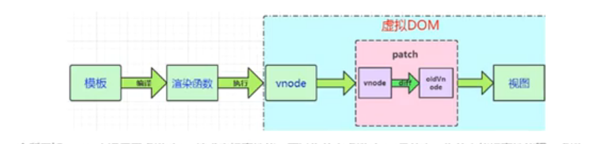
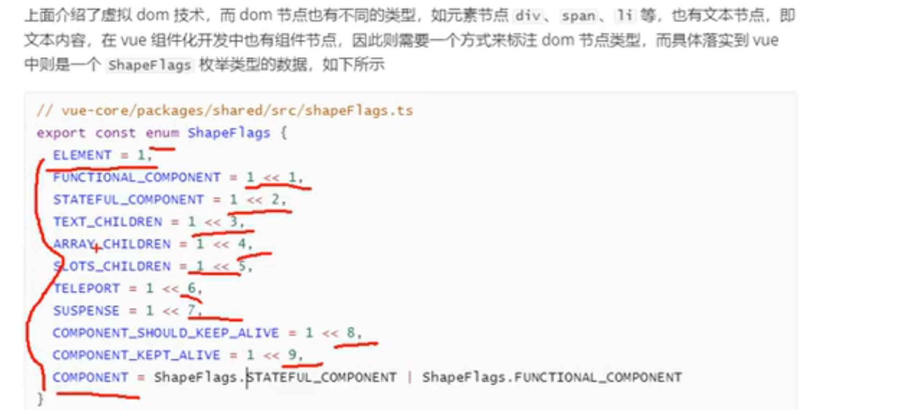
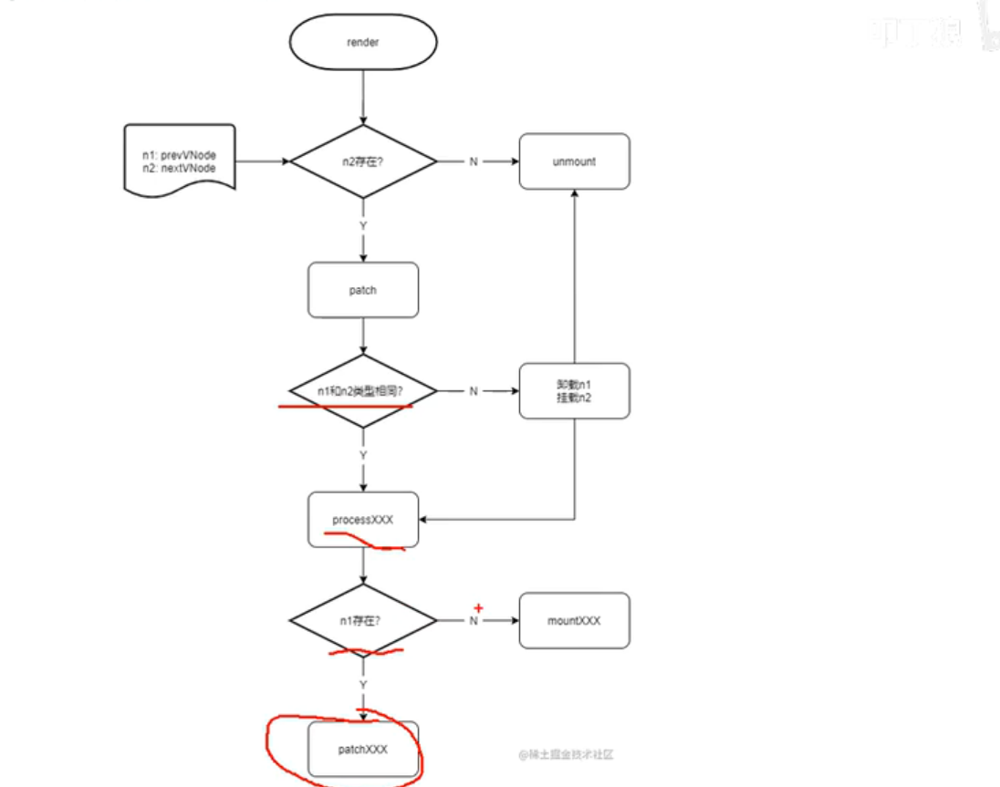
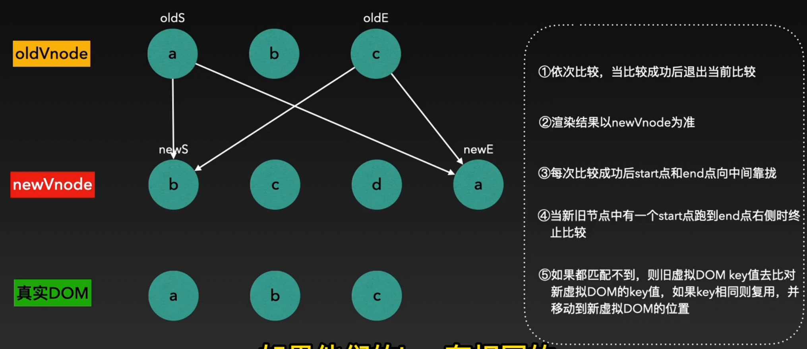

## 响应式系统

Vue3 中的响应式系统依托于 es6 的 proxy 实现，通过拦截 get、set 操作，分别在其中收集依赖、依赖更新：

```js
const reactive = (target) => {
  return new Proxy(target, {
    set(target, key, val, receiver) {
      // do...
      track(); // 记录依赖
    },
    get(target, key, receiver) {
      // do...
      trigger(); // 通知依赖更新
    },
  });
};
```

在 Vue3 中用了 map 的结构来维护每个对象的依赖：

```

targetMap -> obj1 -> key1 -> deps
                  -> key2 -> deps
                  -> key3 -> deps
                  ...
          -> obj2 -> key1 -> deps
                  -> key2 -> deps
                  -> key3 -> deps

          ...

```

因此 track 与 trigger 简单实现如下：

```js
let activeEffect = null;

/**
 * 收集依赖，服务于effect
 */
const track = (target, key) => {
  if (!activeEffect) return;

  // 对象所有key的依赖
  let depMap = targetMap.get(target);
  if (!depMap) {
    depMap = new Map();
    targetMap.set(target, depMap);
  }
  // 判断单个key的依赖
  let deps = depMap.get(key);
  if (!deps) {
    deps = new Set();
    depMap.set(key, deps);
  }
  deps.add(activeEffect);
};

/**
 * 通知依赖更新，服务于effect
 */
const trigger = (target, key) => {
  const depMap = targetMap.get(target);
  if (!depMap) return;
  const deps = depMap.get(key);
  if (!deps) return;
  deps.forEach((effectFn) => {
    // 存在调度器，先执行调度函数
    effectFn.effectHook ? effectFn.effectHook(effectFn) : effectFn();
  });
```

其中 activeEffect 用于记录当前处理的副作用函数。
而为了让 reactive 与 trigger、track 与副作用函数连起来，还需要一个调度响应式对象与副作用函数的 effect：

```js
// 正在执行的副作用
let activeEffect = null;
// 嵌套effect
const effecfStack = [];

/**
 *  * fn：副作用函数
 * 将传入的函数转变为其中响应式对象的副作用函数
 * 初始会执行一次，以记录依赖
 * effectHook会在trigger执行前执行
 * @param {*} fn 响应式对象的副作用函数
 * @param {*} effectHook 执行effect的hook
 * @returns
 */
const effect = (fn, effectHook = null) => {
  const effectFn = () => {
    // 记录当前effect
    try {
      effecfStack.push(effectFn);
      activeEffect = fn;
      return fn();
    } finally {
      effecfStack.pop();
      activeEffect = effecfStack[effecfStack.length - 1];
    }
  };

  // 先执行一次，收集依赖
  effectFn();

  if (effectHook) {
    effectFn.effectHook = effectHook;
  }

  return effectFn;
};
```

其中，对于传入的 fn，利用 effectFn 对其包裹，主要是处理新的 effect 与嵌套 effect，然后在其中执行一次，以收集依赖：

```js
const obj = reactive({ a: 10, b: 20 });

/**
 * effect中传入的函数是当前的副作用函数，而在其中访问的响应式对象会进行收集
 * */
effect(() => {
  console.log(`effect执行了, 输出${obj.a}`);
});

obj.a = 20;
```

此后每访问、设置属性，副作用函数都会执行一次。

## render

Vue3 的一个编译过程：


首先需要对.vue文件进行编译，然后render出对应的虚拟dom。



## patch
patch的流程

对于前后新旧vnode，如果n2不存在，则卸载n1，挂载n2,。
如果存在但是type不一样，一样卸载n1，挂载n2
如果type一样，考虑复用。

## 编译
.vue文件 -> h函数、render函数，在编译响应式数据时，其依赖可以简单地理解成：patch(oldVnode, newVnode);

## diff算法
在vue3中，diff算法采用了首尾指针法+key复用的算法，以newNode为最终渲染结果，比如下面的场景：


终止条件：新旧节点中有一个start > end
1. 比较oldStart与newStart，如果比较成功，oldStart与newStart同时右移，并记录oldDom如何处理；
2. oldStart与newStart比较不成功，则比较oldStart与newEnd，如果比较成功，oldStart右移，newEnd左移，记录oldDom如何处理；
3. 如果oldStart与newEnd比较不成功，则比较oldEnd与newStart，成功则oldEnd左移，newStart右移，记录oldDom如何处理
4. 如果oldEnd与newStart也不匹配，则比较oldEnd与newEnd，如果匹配，两个指针都左移，记录oldDom如何处理，
5. 如果还不匹配，则看key进行复用，判断能否找到oldVnode中的可复用的dom元素。

