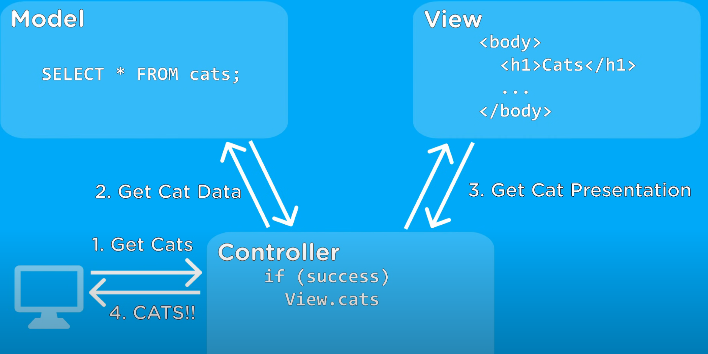

## mv\*

所有的 mvc、mvvm、mvp 架构，都是指 model（m）与 view（v）之间通过何种方式沟通。

### mvc

1. model：模型、数据类，与数据库操作有关
2. view：视图，某种用户界面的表示形式（xml、html）
3. controller：控制图，处理用户请求

下面这个图较好地说明了三者的关系：

1. 用户请求某个数据，请求到达控制器
2. 控制器请求 model，访问数据库获取数据
3. 控制器根据数据情况，返回对应的 view 给客户。
4. model 与 view 之间单向驱动：model -> view

### mvvm

在 mvvm 中，vm（model-view）替换了 c（controller），但实际 vm 与 c 还是类似的。核心区别在于：mvvm 是双向 model 和 view 自动更新
